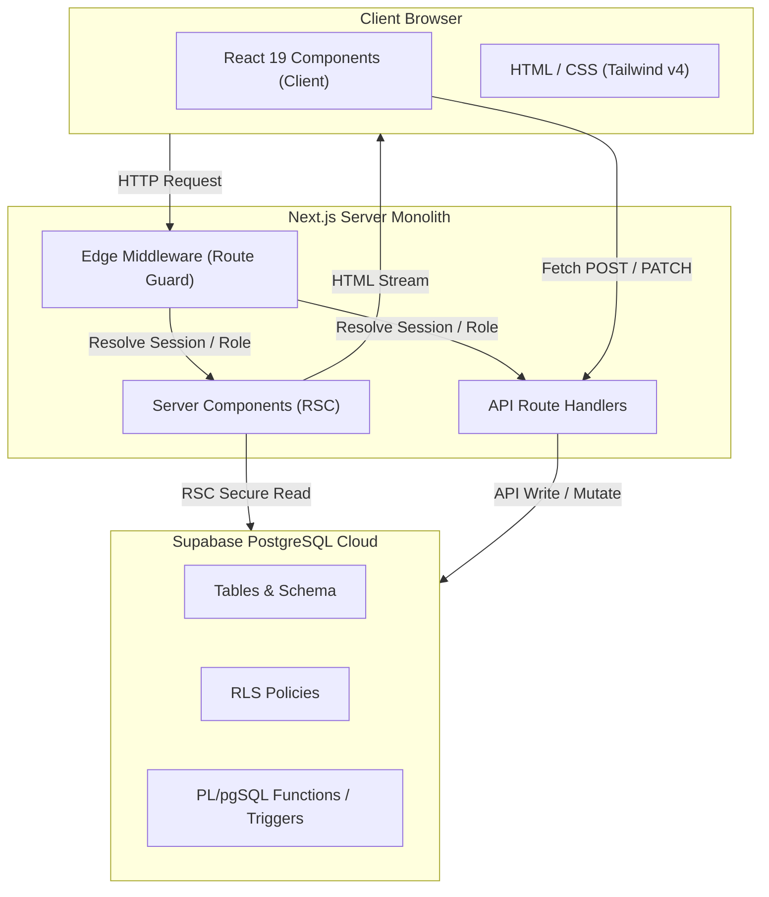
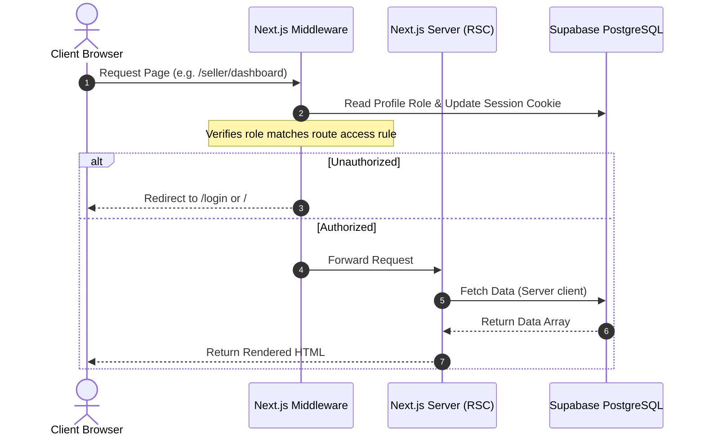

# Architecture Map

This document describes the high-level architecture, design patterns, state handling, routing systems, and security boundaries of the Drivers Australia application.

---

## 1. High-Level Architecture Overview

Drivers Australia is built as a unified Next.js web application. It combines frontend rendering, API route processing, authentication checks, and database management into a single deployable unit.

---

## 2. Server vs. Client Boundary Design

The application follows the React Server Components (RSC) architecture:

### Server Components (RSC)
*   **Default State**: Pages and Layouts (e.g. `/`, `/admin/dashboard`, `/seller/dashboard`) are Server Components.
*   **Security & Performance**: They fetch data securely on the server directly via the Supabase server client. This avoids exposing API endpoints or credentials to the browser and reduces client bundle sizes.
*   **Cookie Management**: They read cookie headers using async Next.js 16 APIs (e.g., `cookies()`) to verify current sessions.

### Client Components
*   **Opt-In**: Indicated by the `'use client'` directive at the top of the file.
*   **Interactivity**: Handles interactive layouts such as the dynamic form builder ([ListingForm.tsx](file:///Users/satveekgupta/Developer/Astraflowww/driversaustralia/components/listings/ListingForm.tsx)), token administration screens, search parameters, and modal dialogs.
*   **Data Synchronization**: Client-side state communicates with Next.js API endpoints via standard `fetch` API operations, triggering page refreshes with `router.refresh()` to update Server Component views.

---

## 3. Data Flow & Routing Lifecycle

---

## 4. Security & Database Isolation Model

Security in Drivers Australia is enforced at two distinct layers:

### Layer 1: Application-Level Protection (Edge Middleware)
*   The middleware intercepts requests before they hit pages.
*   It protects `/seller` and `/admin` routes by ensuring that only users with the corresponding roles in their database profile can load the page content.

### Layer 2: Database-Level Protection (Row-Level Security)
*   **RLS Policies**: Row-Level Security (RLS) is enabled on all tables in Supabase. This ensures that even if application logic is bypassed, data remains secure.
*   **Recursion Prevention**: Directly querying the `profiles` table inside RLS policies for `profiles` creates a loop. The application avoids this by utilizing PostgreSQL helper functions defined with `SECURITY DEFINER` (e.g., `is_admin`, `is_seller` in [004_fix_rls_recursion.sql](file:///Users/satveekgupta/Developer/Astraflowww/driversaustralia/supabase/migrations/004_fix_rls_recursion.sql)). These helper functions run with superuser privileges (bypassing RLS checks) to safely return user role states.
*   **Data Access Rules**:
    *   `profiles`: Users can read/write their own name; admins can manage all profiles; sellers can view applicant buyer profiles.
    *   `listings`: Anyone can view approved listings; sellers can CRUD their own listings; admins can manage all listings.
    *   `responses`: Sellers can view applicant responses for their own listings; anyone can write a response to an approved listing.
    *   `token_transactions`: Users can view their own transaction history; admins can view all transaction logs.
