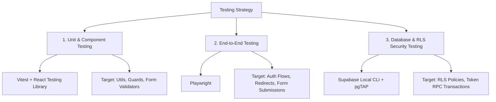

# Testing Status and Strategy

This document details the current state of testing in the Drivers Australia codebase and provides a strategic roadmap for establishing a robust testing suite.

---

## 1. Current Test Status

The project currently has **no testing infrastructure** implemented:
1. **Dependencies**: There are no test runners (Jest, Vitest), component test libraries (React Testing Library), or End-to-End testing frameworks (Playwright, Cypress) defined in [package.json](file:///Users/satveekgupta/Developer/Astraflowww/driversaustralia/package.json).
2. **Scripts**: The `package.json` scripts are limited to run, build, and lint commands. No `test` script exists:
   ```json
   "scripts": {
     "dev": "next dev",
     "build": "next build",
     "start": "next start",
     "lint": "eslint"
   }
   ```
3. **Files & Directories**: There are no test folders (e.g., `__tests__`), file patterns matching test extensions (`*.test.ts`, `*.spec.tsx`), or test config files (e.g., `jest.config.js`, `vitest.config.ts`, `playwright.config.ts`) in the workspace.
4. **Current Validation Method**: Manual verification through UI runs (`next dev`) and lint checks (`eslint`).

---

## 2. Multi-Layered Testing Strategy

To ensure stability across the Next.js 16 App Router, Client Components, API routes, and Supabase RLS security policies, a three-tiered testing structure is recommended.



### Layer 1: Unit & Component Testing
- **Recommended Tooling**: **Vitest** + **React Testing Library** (`@testing-library/react`). Vitest is chosen because it runs natively on ES modules, fits modern compilation configurations, and runs significantly faster than Jest in TypeScript projects.
- **Targets**:
  - Class merger utilities inside [utils.ts](file:///Users/satveekgupta/Developer/Astraflowww/driversaustralia/lib/utils.ts).
  - Conditional rendering in [RoleGuard.tsx](file:///Users/satveekgupta/Developer/Astraflowww/driversaustralia/components/shared/RoleGuard.tsx) (e.g., verifying children vs. fallback layouts render according to roles).
  - UI state and bounds in [TokenBadge.tsx](file:///Users/satveekgupta/Developer/Astraflowww/driversaustralia/components/shared/TokenBadge.tsx).
  - Validation routines, text input additions, and option setups inside [ListingForm.tsx](file:///Users/satveekgupta/Developer/Astraflowww/driversaustralia/components/listings/ListingForm.tsx) and [BuyerResponseForm.tsx](file:///Users/satveekgupta/Developer/Astraflowww/driversaustralia/components/listings/BuyerResponseForm.tsx).
- **Supabase Mocking**:
  - Create standard mocks for `@/lib/supabase/client` and `@/lib/supabase/server`.
  - The mock structure defined inside [client.ts](file:///Users/satveekgupta/Developer/Astraflowww/driversaustralia/lib/supabase/client.ts#L7-L23) can be extended to stub database queries during test runs.

### Layer 2: End-to-End (E2E) Testing
- **Recommended Tooling**: **Playwright**. It provides full-browser automation, page redirects verification, and tracing tools.
- **Critical Flow Scenarios**:
  - **Signup & Profile Creation**: Validate that when a new user signs up, the auth trigger executes successfully, creating a database profile with the correct role and token configurations (3 tokens for sellers, 0 for buyers).
  - **Listing Creation (Token Spend)**: Verify that when a logged-in seller completes a listing, they spend exactly 1 token. Verify that a seller with 0 tokens is blocked from submitting and is shown an error.
  - **Dynamic Form Integration**: Verify that a seller can dynamically build a custom form schema (e.g., adding text fields and selects), save it, and that a buyer can view and submit responses to that specific layout.
  - **Middleware Guards**: Verify that route guards block unauthenticated users from protected `/seller` and `/admin` paths, appending proper search parameters for redirection.

### Layer 3: Database & RLS Security Testing
- **Recommended Tooling**: **pgTAP** or Node-based integration runs against a local Supabase CLI emulator database.
- **Targets**:
  - **Row Level Security (RLS) Policies**: Ensure that RLS policies configured in [004_fix_rls_recursion.sql](file:///Users/satveekgupta/Developer/Astraflowww/driversaustralia/supabase/migrations/004_fix_rls_recursion.sql) correctly allow/deny access based on the user's role:
    - Buyers cannot update profiles or delete listings.
    - Sellers can insert and modify their own listings but cannot modify other sellers' listings.
    - Public visitors can only view approved listings.
  - **Database Functions & Triggers**: Test database routines like `spend_token` and `adjust_user_tokens` to verify they run atomically, reject invalid inputs, and correctly log entries in `token_transactions`.

---

## 3. Testing Roadmap & Implementation

To configure testing in the project, follow these phased steps:

### Phase 1: Unit Test Harness Setup (Vitest)
1. Install dependencies:
   ```bash
   npm install -D vitest @testing-library/react @testing-library/jest-dom @testing-library/user-event jsdom @vitejs/plugin-react
   ```
2. Create `vitest.config.ts` in the root:
   ```typescript
   import { defineConfig } from 'vitest/config'
   import react from '@vitejs/plugin-react'
   import path from 'path'

   export default defineConfig({
     plugins: [react()],
     test: {
       environment: 'jsdom',
       globals: true,
       setupFiles: './vitest.setup.ts',
       alias: {
         '@': path.resolve(__dirname, './')
       }
     }
   })
   ```
3. Create `vitest.setup.ts` to extend jest-dom matchers:
   ```typescript
   import '@testing-library/jest-dom'
   ```
4. Add the execution script to `package.json`:
   ```json
   "test": "vitest run",
   "test:watch": "vitest"
   ```

### Phase 2: End-to-End Setup (Playwright)
1. Initialize Playwright:
   ```bash
   npm init playwright@latest
   ```
2. Configure `playwright.config.ts` to load environment variables from `.env.local` and start the Next.js server locally during runs:
   ```typescript
   import { defineConfig } from '@playwright/test'
   import dotenv from 'dotenv'
   import path from 'path'

   dotenv.config({ path: path.resolve(__dirname, '.env.local') })

   export default defineConfig({
     testDir: './tests/e2e',
     use: {
       baseURL: 'http://localhost:3000',
       trace: 'on-first-retry',
     },
     webServer: {
       command: 'npm run dev',
       url: 'http://localhost:3000',
       reuseExistingServer: !process.env.CI,
     },
   })
   ```

### Phase 3: Database & Security Testing (Supabase CLI)
1. Initialize Supabase locally:
   ```bash
   supabase init
   ```
2. Use the local Supabase container to execute migration scripts and test database logic.
3. Write test scripts (using toolkits like pgTAP or custom node client testing) that assert query errors when trying to select or update table values with simulated unprivileged auth sessions.
